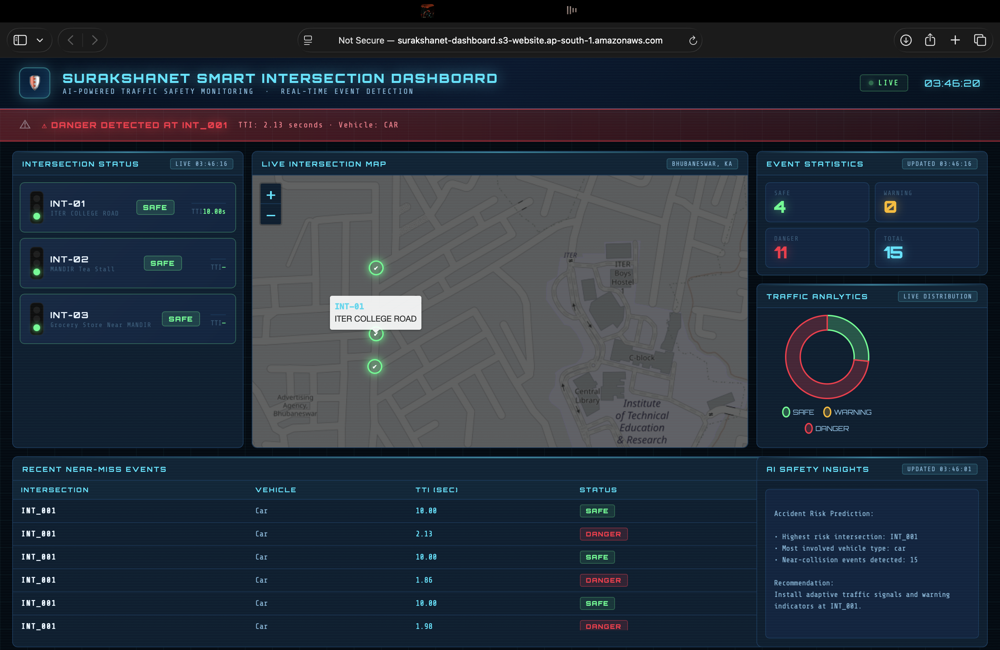

  

# 🚦 SurakshaNet

### Edge AI Powered Road Safety System

AI-powered system that detects dangerous traffic situations in real time and prevents accidents using **Edge AI + AWS Cloud + Predictive Analytics**.

# 🚦 SurakshaNet — Edge AI Road Safety System

AI-powered real-time accident prevention using Edge AI and AWS Cloud.

SurakshaNet is an intelligent road safety system that detects dangerous traffic situations **before accidents happen**.  
Using **Edge AI vehicle detection**, **time-to-collision prediction**, and **cloud-based analysis**, the system warns drivers and provides live traffic safety insights.

---

# 🧠 Problem

Road accidents cause **1.19 million deaths globally every year**.

Most accidents happen due to:

• delayed driver reaction  
• poor visibility  
• lack of real-time monitoring  
• no predictive accident detection

Most existing systems detect accidents **after they happen**.

SurakshaNet focuses on **preventing accidents before they occur.**

---

# 💡 Solution

SurakshaNet combines **Edge AI + Cloud Intelligence** to detect dangerous traffic scenarios in real time.

The system performs:

1. Vehicle detection at the edge  
2. Time-to-collision prediction  
3. Real-time risk detection  
4. Instant driver alerts  
5. Cloud traffic analytics  
6. AI-generated safety insights

---

# 🏗 System Architecture

The system works across three intelligent layers.

---

## 1️⃣ Edge AI Layer

Android detector device performs real-time processing.

Features:

• Camera input  
• Vehicle detection using **TensorFlow Lite**  
• Distance estimation  
• Time-to-collision calculation  

If a dangerous scenario is detected:

Vehicle detected → Collision predicted → Alert sent to cloud

Alerts are published using **AWS IoT MQTT**.

---

## 2️⃣ Cloud Processing Layer (AWS)

Incoming events are processed using a serverless pipeline.

Android Detector  
↓  
AWS IoT Core (MQTT)  
↓  
Lambda Processor  
↓  
DynamoDB (traffic events database)  
↓  
Lambda AI Analysis  
↓  
Amazon Bedrock (AI insights)

The AI layer generates:

• accident risk prediction  
• incident explanations  
• safety recommendations

---

## 3️⃣ Application Layer

Data is exposed through APIs and visualized in a dashboard.

Lambda Dashboard API  
↓  
API Gateway  
↓  
S3 Hosted Dashboard

Users can monitor:

• high risk intersections  
• near collision events  
• traffic alerts  
• AI insights

---

# 🚨 Real-Time Indicator System

SurakshaNet also includes a **smart warning indicator device**.

When a dangerous event is detected:

Detector  
↓  
Cloud Processing  
↓  
MQTT Alert  
↓  
Indicator Device

The indicator triggers:

• visual warning light  
• beeping alert

This provides **instant driver awareness**.

---

# 🤖 AI Capabilities

SurakshaNet uses AI in two layers.

### Edge AI
• vehicle detection  
• object tracking  
• collision prediction

### Cloud AI
Using **Amazon Bedrock** for:

• incident explanations  
• accident risk prediction  
• traffic insights

Example AI output:

Accident Risk Prediction

Highest risk intersection: INT_001  
Most involved vehicle type: motorcycle  
Near-collision events detected: 11

Recommendation:  
Install adaptive traffic signals at INT_001.

---

# ⚙️ Technologies Used

### Edge AI
TensorFlow Lite  
Android (Kotlin)  
CameraX  

### Cloud
AWS IoT Core  
AWS Lambda  
Amazon DynamoDB  
Amazon Bedrock  
API Gateway  
Amazon S3  

### Frontend
HTML  
JavaScript  
Chart.js  

---

# 📊 Features

🚗 Edge AI Vehicle Detection  
Real-time vehicle detection using lightweight neural networks.

⏱ Collision Prediction  
Time-to-collision algorithm predicts dangerous situations.

☁️ Serverless Cloud Pipeline  
Fully serverless AWS architecture.

🧠 AI Traffic Analysis  
Cloud AI analyzes traffic data and predicts accident risks.

📊 Live Safety Dashboard  
Real-time visualization of incidents and safety insights.

🚨 Smart Indicator Device  
Physical warning system for driver alerts.

---

# 📂 Project Structure

surakshanet-edge-ai-safety
│
├── dashboard
│ └── dashboard.html
│
├── lambda
│ ├── processor_lambda.py
│ ├── dashboard_api_lambda.py
│ └── ai_analysis_lambda.py
│
├── android-detector-app
│ └── SurakshaNetDetector
│
├── architecture
│ └── architecture_diagram.png
│
├── README.md
├── design.md
└── requirements.md

---

# 🔮 Future Improvements

• multi-camera intersection monitoring  
• smart traffic light integration  
• emergency vehicle detection  
• city-scale accident prediction  
• AI traffic simulation

---

# 🌍 Impact

SurakshaNet helps:

• reduce road accidents  
• improve driver awareness  
• enable smart intersections  
• support future smart cities

By combining **Edge AI + Cloud Intelligence**, SurakshaNet helps create **safer roads for everyone.**

---

# 👨‍💻 Team

Built for the **AI for Bharat Hackathon**

Team SurakshaNet

---

# ⭐ Support

If you like this project, give the repository a ⭐

