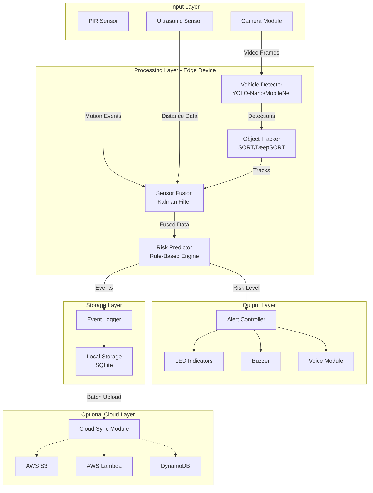
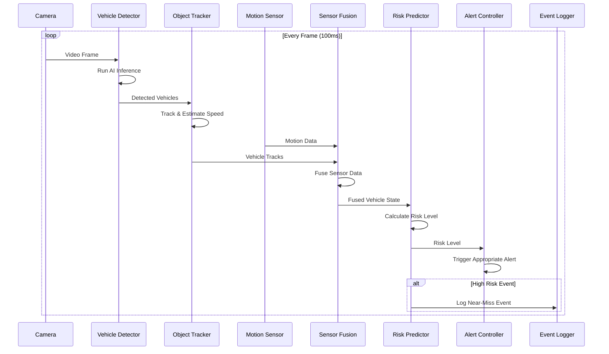

# Design Document: SurakshaNet Edge AI Safety System

## Overview

SurakshaNet is an edge-AI powered road safety system designed to prevent collisions at blind intersections in India. The system operates entirely offline on a Raspberry Pi 4, using camera-based AI vehicle detection as the primary decision source, with motion sensors (PIR/ultrasonic) providing secondary support for presence confirmation and power optimization.

The architecture follows an offline-first design principle where all safety-critical operations (detection, tracking, risk prediction, alerting) execute locally without requiring internet connectivity. An optional cloud synchronization module uploads summarized event data during low-activity periods for post-event analytics without impacting real-time performance.

The system aims to process video at 10+ FPS using lightweight AI models (YOLO-Nano or MobileNet-SSD), tracks vehicles across frames, estimates speed and time-to-collision, predicts risk levels, and triggers multi-modal alerts (LED, buzzer, voice) with a target of sub-second end-to-end latency.

### Key Design Principles

1. **Offline-First**: All critical functions work without internet connectivity
2. **Edge Processing**: All AI inference runs locally on the Raspberry Pi
3. **Camera-Primary Architecture**: Camera-based AI is the primary decision source; motion sensors provide secondary support
4. **Modular Architecture**: Support different intersection configurations (3-way, 4-way, 5-way)
5. **Fail-Safe Operation**: Graceful degradation when components fail
6. **Low Latency**: Target sub-second detection-to-alert pipeline
7. **Cost Optimization**: Target ₹4,000-₹5,000 standalone unit cost

## Architecture

### System Architecture Diagram



### Component Interaction Flow



## Components and Interfaces

### 1. Vehicle Detector

**Responsibility**: Detect and classify vehicles in video frames using lightweight AI models.

**Implementation**:
- Use YOLO-Nano or MobileNet-SSD pre-trained on vehicle datasets
- Optimize model for Raspberry Pi using TensorFlow Lite or ONNX Runtime
- Input: 416x416 or 320x320 RGB image frames
- Output: Bounding boxes with class labels (bike, car, heavy_vehicle) and confidence scores
- Target: 10+ FPS on Raspberry Pi 4

**Interface**:
```python
class VehicleDetector:
    def __init__(self, model_path: str, confidence_threshold: float = 0.5):
        """Initialize detector with model file and confidence threshold"""
        
    def detect(self, frame: np.ndarray) -> List[Detection]:
        """
        Detect vehicles in a single frame
        
        Args:
            frame: RGB image as numpy array (H, W, 3)
            
        Returns:
            List of Detection objects containing:
            - bbox: (x1, y1, x2, y2) bounding box coordinates
            - class_name: 'bike', 'car', or 'heavy_vehicle'
            - confidence: detection confidence score (0-1)
        """
        
    def switch_to_night_mode(self):
        """Switch to night-mode detection using headlight signatures"""
        
    def switch_to_day_mode(self):
        """Switch to standard day-mode detection"""
```

**Night Mode Adaptation**:
- Use separate model weights trained on headlight detection
- Apply image preprocessing to enhance bright spots (headlights)
- Lower confidence threshold for night detections (0.4 vs 0.5)

### 2. Object Tracker

**Responsibility**: Track detected vehicles across frames and estimate speed, direction, and time-to-collision.

**Implementation**:
- Use SORT (Simple Online Realtime Tracking) or lightweight DeepSORT
- Maintain unique IDs for each tracked vehicle
- Calculate speed using distance traveled between frames and known camera calibration
- Estimate time-to-collision using current speed and distance to intersection point

**Interface**:
```python
class ObjectTracker:
    def __init__(self, max_age: int = 30, min_hits: int = 3):
        """
        Initialize tracker
        
        Args:
            max_age: Maximum frames to keep track alive without detection
            min_hits: Minimum detections before confirming track
        """
        
    def update(self, detections: List[Detection], frame_time: float) -> List[Track]:
        """
        Update tracks with new detections
        
        Args:
            detections: List of Detection objects from current frame
            frame_time: Timestamp of current frame
            
        Returns:
            List of Track objects containing:
            - track_id: Unique identifier for this vehicle
            - bbox: Current bounding box
            - class_name: Vehicle type
            - speed_kmh: Estimated speed in km/h
            - direction: Movement direction vector (dx, dy)
            - positions: Historical positions for trajectory
        """
        
    def estimate_time_to_collision(self, track: Track, intersection_point: Tuple[int, int]) -> float:
        """
        Estimate seconds until vehicle reaches intersection
        
        Args:
            track: Track object with current position and speed
            intersection_point: (x, y) pixel coordinates of intersection center
            
        Returns:
            Estimated time to collision in seconds
        """
```

**Speed Estimation Algorithm**:
1. Calculate pixel distance traveled between consecutive frames
2. Convert pixel distance to real-world meters using camera calibration matrix
3. Divide distance by time delta between frames to get m/s
4. Convert to km/h

**Camera Calibration**:
- Store calibration matrix mapping pixel coordinates to real-world distances
- Calibration performed during installation using known reference distances
- Account for camera height, angle, and lens distortion

### 3. Motion Sensor Interface

**Responsibility**: Interface with PIR and ultrasonic sensors for presence confirmation and power optimization.

**Implementation**:
- Support both PIR (passive infrared) and ultrasonic distance sensors
- PIR detects motion within approximately 10-meter range
- Ultrasonic measures distance to approaching objects
- Trigger camera activation from low-power mode
- Provide secondary confirmation of vehicle presence

**Interface**:
```python
class MotionSensor:
    def __init__(self, sensor_type: str, gpio_pin: int):
        """
        Initialize motion sensor
        
        Args:
            sensor_type: 'pir' or 'ultrasonic'
            gpio_pin: Raspberry Pi GPIO pin number
        """
        
    def detect_motion(self) -> bool:
        """
        Check if motion is detected
        
        Returns:
            True if motion detected, False otherwise
        """
        
    def get_distance(self) -> Optional[float]:
        """
        Get distance to nearest object (ultrasonic only)
        
        Returns:
            Distance in meters, or None if not available
        """
        
    def set_callback(self, callback: Callable):
        """Register callback function for motion events"""
```

### 4. Sensor Fusion Module

**Responsibility**: Combine camera detections with motion sensor data to improve reliability through confidence-weighted fusion.

**Implementation**:
- Use lightweight filtering to combine camera-based position estimates with motion sensor data
- Increase detection confidence when both sensors agree
- Generate cautionary alerts when camera fails but motion is detected
- Smooth noisy position estimates

**Interface**:
```python
class SensorFusion:
    def __init__(self):
        """Initialize lightweight filtering for sensor fusion"""
        
    def fuse(self, camera_tracks: List[Track], motion_detected: bool, 
             ultrasonic_distance: Optional[float]) -> List[FusedTrack]:
        """
        Fuse camera and motion sensor data using confidence-weighted fusion
        
        Args:
            camera_tracks: Tracks from object tracker
            motion_detected: Boolean from PIR sensor
            ultrasonic_distance: Distance from ultrasonic sensor
            
        Returns:
            List of FusedTrack objects with improved confidence and position estimates
        """
        
    def handle_camera_failure(self, motion_detected: bool) -> Optional[FusedTrack]:
        """
        Generate cautionary fallback track when camera is unavailable
        
        Returns:
            Synthetic track with Medium confidence if motion detected
        """
```

**Fusion Logic**:
- If camera detects vehicle AND motion sensor detects movement: High confidence
- If camera detects vehicle BUT no motion: Medium confidence (possible false positive)
- If motion detected BUT no camera detection: Low confidence (trigger cautionary Medium risk alert)
- If neither detects anything: No alert

### 5. Risk Predictor

**Responsibility**: Calculate collision risk level based on vehicle parameters and environmental factors.

**Implementation**:
- Rule-based engine using time-to-collision as primary metric
- Consider vehicle type, speed, direction, and time of day
- Output risk level: Low, Medium, or High

**Interface**:
```python
class RiskPredictor:
    def __init__(self, config: RiskConfig):
        """
        Initialize risk predictor with configuration
        
        Args:
            config: RiskConfig object with thresholds and weights
        """
        
    def predict_risk(self, tracks: List[FusedTrack], time_of_day: str) -> RiskLevel:
        """
        Predict collision risk level
        
        Args:
            tracks: List of fused vehicle tracks
            time_of_day: 'day' or 'night'
            
        Returns:
            RiskLevel enum: LOW, MEDIUM, or HIGH
        """
        
    def calculate_risk_score(self, track: FusedTrack, time_of_day: str) -> float:
        """
        Calculate numerical risk score for a single vehicle
        
        Returns:
            Risk score from 0.0 (no risk) to 1.0 (maximum risk)
        """
```

**Risk Calculation Algorithm**:
```
risk_score = 0.0

# Time-to-collision component (primary factor)
if ttc < 5 seconds:
    risk_score += 0.6
elif ttc < 10 seconds:
    risk_score += 0.3
else:
    risk_score += 0.1

# Speed component
if speed > 60 km/h:
    risk_score += 0.2
elif speed > 40 km/h:
    risk_score += 0.1

# Vehicle type component
if vehicle_type == 'heavy_vehicle':
    risk_score += 0.1
elif vehicle_type == 'bike':
    risk_score += 0.05

# Time of day component
if time_of_day == 'night':
    risk_score *= 1.2  # 20% increase for night

# Direction component
if moving_toward_intersection:
    risk_score *= 1.0
else:
    risk_score *= 0.5  # Reduce risk if moving away

# Final classification
if risk_score >= 0.7:
    return HIGH
elif risk_score >= 0.4:
    return MEDIUM
else:
    return LOW
```

### 6. Alert Controller

**Responsibility**: Manage multi-modal alerts (LED, buzzer, voice) based on risk level.

**Implementation**:
- Control GPIO pins for LED and buzzer
- Play pre-recorded voice alerts using audio output
- Implement alert state machine to handle transitions

**Interface**:
```python
class AlertController:
    def __init__(self, led_pins: Dict[str, int], buzzer_pin: int, 
                 audio_device: str, volume: int = 80):
        """
        Initialize alert controller
        
        Args:
            led_pins: Dictionary mapping 'yellow' and 'red' to GPIO pins
            buzzer_pin: GPIO pin for buzzer
            audio_device: Audio output device name
            volume: Volume level (0-100)
        """
        
    def update_alert(self, risk_level: RiskLevel):
        """
        Update alert state based on risk level
        
        Args:
            risk_level: Current risk level (LOW, MEDIUM, HIGH)
        """
        
    def play_voice_alert(self, language: str = 'both'):
        """
        Play voice alert in specified language
        
        Args:
            language: 'hindi', 'english', or 'both'
        """
        
    def set_volume(self, volume: int):
        """Set volume level for buzzer and voice (0-100)"""
        
    def test_alerts(self):
        """Test all alert mechanisms"""
```

**Alert State Machine**:
```
LOW -> No alerts active
MEDIUM -> Yellow LED ON, Single beep
HIGH -> Red LED ON, Continuous beeping, Voice alert

Transitions:
- LOW -> MEDIUM: Activate yellow LED, beep once
- MEDIUM -> HIGH: Switch to red LED, start continuous beep, play voice
- HIGH -> MEDIUM: Switch to yellow LED, stop continuous beep
- MEDIUM/HIGH -> LOW: Deactivate all alerts
```

**Voice Alert Files**:
- `alert_hindi.wav`: "खतरा! वाहन आ रहा है" (Danger! Vehicle approaching)
- `alert_english.wav`: "Danger! Vehicle approaching"
- Stored locally in `/opt/surakshanet/audio/`
- Pre-recorded at high quality for clarity

### 7. Event Logger

**Responsibility**: Log near-miss and high-risk events to local storage with metadata and images.

**Implementation**:
- Use SQLite database for structured event storage
- Save camera snapshots as JPEG files
- Implement automatic cleanup of old events
- Provide query interface for diagnostics

**Interface**:
```python
class EventLogger:
    def __init__(self, db_path: str, image_dir: str, max_storage_gb: float = 10.0):
        """
        Initialize event logger
        
        Args:
            db_path: Path to SQLite database file
            image_dir: Directory for storing event images
            max_storage_gb: Maximum storage to use before cleanup
        """
        
    def log_event(self, event: Event, frame: np.ndarray):
        """
        Log a near-miss or high-risk event
        
        Args:
            event: Event object with metadata
            frame: Camera frame to save as snapshot
        """
        
    def get_events(self, start_time: datetime, end_time: datetime) -> List[Event]:
        """Query events within time range"""
        
    def cleanup_old_events(self, days_to_keep: int = 30):
        """Delete events older than specified days"""
        
    def get_storage_usage(self) -> float:
        """Get current storage usage in GB"""
```

**Event Schema**:
```sql
CREATE TABLE events (
    id INTEGER PRIMARY KEY AUTOINCREMENT,
    timestamp DATETIME NOT NULL,
    risk_level TEXT NOT NULL,
    vehicle_type TEXT,
    speed_kmh REAL,
    time_to_collision REAL,
    risk_score REAL,
    image_path TEXT,
    sensor_confidence REAL,
    weather_condition TEXT
);

CREATE INDEX idx_timestamp ON events(timestamp);
CREATE INDEX idx_risk_level ON events(risk_level);
```

### 8. Cloud Sync Module (Optional)

**Responsibility**: Upload summarized event data to AWS during low-activity periods for post-event analytics without impacting real-time operations.

**Implementation**:
- Run as separate low-priority thread
- Batch upload events during idle periods
- Use AWS SDK for S3, Lambda, and DynamoDB
- Handle network failures gracefully
- All cloud components are optional and independent of safety-critical operations

**Interface**:
```python
class CloudSyncModule:
    def __init__(self, config: CloudConfig, enabled: bool = False):
        """
        Initialize cloud sync module
        
        Args:
            config: CloudConfig with AWS credentials and endpoints
            enabled: Whether cloud sync is enabled
        """
        
    def sync_events(self, events: List[Event]):
        """
        Upload events to cloud storage
        
        Args:
            events: List of events to upload
        """
        
    def is_idle_period(self) -> bool:
        """Check if system is in low-activity period suitable for sync"""
        
    def get_pending_events(self) -> List[Event]:
        """Get events that haven't been synced yet"""
        
    def mark_synced(self, event_ids: List[int]):
        """Mark events as successfully synced"""
```

**AWS Architecture** (Optional - Post-Event Analytics Only):
- **S3**: Store event images and raw data
- **Lambda**: Process uploaded events, extract statistics
- **DynamoDB**: Store event metadata for querying
- **CloudWatch**: Monitor sync health and errors

Note: All AWS components are optional and used only for post-event analytics. Real-time safety operations are completely independent of cloud services.

**Sync Strategy**:
- Check for idle period (no High risk alerts for 5 minutes)
- Batch up to 100 events per upload
- Compress images before upload
- Retry failed uploads with exponential backoff
- Never block real-time detection pipeline

### 9. Configuration Manager

**Responsibility**: Manage system configuration, calibration settings, and intersection geometry.

**Interface**:
```python
class ConfigManager:
    def __init__(self, config_file: str = '/etc/surakshanet/config.yaml'):
        """Load configuration from file"""
        
    def get_intersection_config(self) -> IntersectionConfig:
        """Get intersection geometry and detection zones"""
        
    def get_risk_config(self) -> RiskConfig:
        """Get risk prediction thresholds and weights"""
        
    def get_camera_calibration(self) -> CameraCalibration:
        """Get camera calibration matrix"""
        
    def save_config(self):
        """Save current configuration to file"""
        
    def enter_calibration_mode(self):
        """Enter interactive calibration mode"""
```

**Configuration File Structure** (YAML):
```yaml
intersection:
  type: "4-way"  # 3-way, 4-way, 5-way
  approaches:
    - name: "North"
      camera_id: 0
      detection_zone: [[x1,y1], [x2,y2], [x3,y3], [x4,y4]]
      distance_to_center: 50  # meters
      typical_speed: 40  # km/h
    - name: "South"
      camera_id: 1
      detection_zone: [[x1,y1], [x2,y2], [x3,y3], [x4,y4]]
      distance_to_center: 50
      typical_speed: 40

camera:
  resolution: [1280, 720]
  fps: 15
  calibration_matrix: [[fx, 0, cx], [0, fy, cy], [0, 0, 1]]
  distortion_coeffs: [k1, k2, p1, p2, k3]

risk:
  high_threshold: 0.7
  medium_threshold: 0.4
  ttc_high: 5  # seconds
  ttc_medium: 10  # seconds
  night_multiplier: 1.2

alerts:
  volume: 80
  languages: ["hindi", "english"]
  led_pins:
    yellow: 17
    red: 27
  buzzer_pin: 22

cloud:
  enabled: false
  aws_region: "ap-south-1"
  s3_bucket: "surakshanet-events"
  sync_interval: 300  # seconds
```

## Data Models

### Detection
```python
@dataclass
class Detection:
    bbox: Tuple[int, int, int, int]  # (x1, y1, x2, y2)
    class_name: str  # 'bike', 'car', 'heavy_vehicle'
    confidence: float  # 0.0 to 1.0
    timestamp: float
```

### Track
```python
@dataclass
class Track:
    track_id: int
    bbox: Tuple[int, int, int, int]
    class_name: str
    speed_kmh: float
    direction: Tuple[float, float]  # (dx, dy) normalized vector
    positions: List[Tuple[int, int]]  # Historical (x, y) positions
    age: int  # Frames since first detection
    hits: int  # Number of successful detections
    time_since_update: int  # Frames since last detection
```

### FusedTrack
```python
@dataclass
class FusedTrack:
    track: Track
    confidence: float  # Confidence-weighted fusion from camera + motion sensors
    motion_sensor_confirmed: bool
    ultrasonic_distance: Optional[float]
    filter_state: np.ndarray  # Lightweight filter state vector
```

### RiskLevel
```python
class RiskLevel(Enum):
    LOW = 0
    MEDIUM = 1
    HIGH = 2
```

### Event
```python
@dataclass
class Event:
    timestamp: datetime
    risk_level: RiskLevel
    vehicle_type: str
    speed_kmh: float
    time_to_collision: float
    risk_score: float
    image_path: str
    sensor_confidence: float
    weather_condition: Optional[str]
    approach_direction: str
```

### IntersectionConfig
```python
@dataclass
class ApproachConfig:
    name: str
    camera_id: int
    detection_zone: List[Tuple[int, int]]  # Polygon vertices
    distance_to_center: float  # meters
    typical_speed: float  # km/h

@dataclass
class IntersectionConfig:
    type: str  # '3-way', '4-way', '5-way'
    approaches: List[ApproachConfig]
```

### RiskConfig
```python
@dataclass
class RiskConfig:
    high_threshold: float = 0.7
    medium_threshold: float = 0.4
    ttc_high: float = 5.0  # seconds
    ttc_medium: float = 10.0  # seconds
    night_multiplier: float = 1.2
    speed_weight: float = 0.2
    vehicle_type_weights: Dict[str, float] = field(default_factory=lambda: {
        'bike': 0.05,
        'car': 0.0,
        'heavy_vehicle': 0.1
    })
```

### CameraCalibration
```python
@dataclass
class CameraCalibration:
    camera_matrix: np.ndarray  # 3x3 intrinsic matrix
    distortion_coeffs: np.ndarray  # Distortion coefficients
    height_meters: float  # Camera height above ground
    tilt_angle_degrees: float  # Camera tilt angle
    
    def pixel_to_world(self, pixel_coords: Tuple[int, int]) -> Tuple[float, float]:
        """Convert pixel coordinates to real-world meters"""
        
    def world_to_pixel(self, world_coords: Tuple[float, float]) -> Tuple[int, int]:
        """Convert real-world meters to pixel coordinates"""
```


## Correctness Properties

A property is a characteristic or behavior that should hold true across all valid executions of a system—essentially, a formal statement about what the system should do. Properties serve as the bridge between human-readable specifications and machine-verifiable correctness guarantees.

### Property 1: Vehicle Classification Validity

*For any* detected vehicle, the classification output SHALL be one of the three valid vehicle types: 'bike', 'car', or 'heavy_vehicle'.

**Validates: Requirements 1.2**

### Property 2: Multi-Vehicle Detection Independence

*For any* video frame containing N vehicles, the Vehicle_Detector SHALL produce N independent detection results, each with its own bounding box and classification.

**Validates: Requirements 1.4**

### Property 3: Night Mode Vehicle Detection

*For any* vehicle with visible headlights in night-mode conditions, the Vehicle_Detector SHALL successfully detect the vehicle.

**Validates: Requirements 1.5**

### Property 4: Track Persistence Across Frames

*For any* vehicle detected in frame N that remains visible in frame N+1, the Object_Tracker SHALL maintain the same track_id for that vehicle across both frames.

**Validates: Requirements 2.1**

### Property 5: Track ID Uniqueness

*For any* set of active tracks at a given moment, all track_id values SHALL be unique (no two tracks share the same ID).

**Validates: Requirements 2.2**

### Property 6: Speed Calculation Validity

*For any* tracked vehicle, the calculated speed SHALL be a non-negative value in km/h and SHALL not exceed 200 km/h (physical reasonableness constraint).

**Validates: Requirements 2.3**

### Property 7: Direction Vector Normalization

*For any* tracked vehicle with detected movement, the direction vector SHALL be normalized (magnitude between 0 and 1) and SHALL point in the direction of motion.

**Validates: Requirements 2.4**

### Property 8: Time-to-Collision Monotonicity

*For any* vehicle moving toward the intersection, the Time_To_Collision SHALL be positive and SHALL decrease over consecutive frames as the vehicle approaches.

**Validates: Requirements 2.5**

### Property 9: Risk Level Validity

*For any* vehicle track, the Risk_Predictor SHALL output a Risk_Level that is one of: LOW, MEDIUM, or HIGH.

**Validates: Requirements 3.1**

### Property 10: Time-to-Collision Risk Classification

*For any* vehicle with calculated Time_To_Collision:
- IF TTC < 5 seconds, THEN Risk_Level SHALL be HIGH
- IF 5 ≤ TTC ≤ 10 seconds, THEN Risk_Level SHALL be MEDIUM  
- IF TTC > 10 seconds, THEN Risk_Level SHALL be LOW

**Validates: Requirements 3.3, 3.4, 3.5**

### Property 11: Night Risk Amplification

*For any* vehicle, the risk_score calculated at night SHALL be greater than or equal to the risk_score calculated during day (with all other parameters held constant).

**Validates: Requirements 3.6**

### Property 12: Multi-Vehicle Maximum Risk

*For any* set of vehicles with different risk levels, the Risk_Predictor SHALL report the maximum Risk_Level among all vehicles.

**Validates: Requirements 3.7**

### Property 13: Motion-Triggered Camera Activation

*For any* motion detection event when the Camera_Module is in low-power mode, the SurakshaNet_System SHALL activate the Camera_Module.

**Validates: Requirements 4.1**

### Property 14: Sensor Fusion Confidence Boost

*For any* vehicle detection, when both Motion_Sensor and Camera_Module detect the vehicle, the fused confidence SHALL be higher than camera-only confidence.

**Validates: Requirements 4.2**

### Property 15: Motion-Only Fallback Alert

*For any* scenario where Motion_Sensor detects presence but Camera_Module detects no vehicle, the SurakshaNet_System SHALL trigger a cautionary MEDIUM risk alert.

**Validates: Requirements 4.3**

### Property 16: Risk-to-Alert Mapping

*For any* Risk_Level:
- IF Risk_Level is LOW, THEN no alerts SHALL be active
- IF Risk_Level is MEDIUM, THEN yellow LED SHALL be ON and buzzer SHALL beep once
- IF Risk_Level is HIGH, THEN red LED SHALL be ON, buzzer SHALL beep continuously, and voice alert SHALL play

**Validates: Requirements 5.1, 5.2, 5.3**

### Property 17: Bilingual Voice Alert

*For any* voice alert triggered by HIGH risk, the Alert_Controller SHALL play audio in English , Hindi and any local language according to the location.

**Validates: Requirements 5.4**

### Property 18: Volume Control Effectiveness

*For any* configured volume level V, the actual output volume SHALL correspond to the configured level V.

**Validates: Requirements 5.7**

### Property 19: Alert Persistence Under Multi-Vehicle High Risk

*For any* scenario where at least one vehicle has HIGH risk, the Alert_Controller SHALL maintain HIGH risk alert state (red LED, continuous beep, voice) until all vehicles drop below HIGH risk.

**Validates: Requirements 5.8**

### Property 20: High-Risk Event Logging Completeness

*For any* HIGH risk event, the Event_Logger SHALL create a log entry containing all required fields: timestamp, vehicle_type, speed_kmh, risk_score, and image_path.

**Validates: Requirements 6.1, 6.3**

### Property 21: Storage Cleanup FIFO Order

*For any* storage cleanup operation when capacity reaches 90%, the Event_Logger SHALL delete events in first-in-first-out order (oldest events deleted first).

**Validates: Requirements 6.4**

### Property 22: Event Retention Policy

*For any* automatic cleanup operation, events with age less than 30 days SHALL NOT be deleted.

**Validates: Requirements 6.5**

### Property 23: Event Data Round-Trip Consistency

*For any* event logged to storage, reading the event back SHALL produce an equivalent Event object with all fields preserved (serialization round-trip property).

**Validates: Requirements 6.6, 6.7**

### Property 24: Offline Operation Completeness

*For any* system operation (detection, tracking, risk prediction, alerting, logging) with network connectivity disabled, the operation SHALL complete successfully without errors.

**Validates: Requirements 7.1, 7.3, 8.7**

### Property 25: Offline Event Logging Continuity

*For any* HIGH risk event occurring when internet connectivity is unavailable, the Event_Logger SHALL successfully log the event to local storage.

**Validates: Requirements 7.4**

### Property 26: Cloud Upload Eventual Consistency

*For any* event logged locally when cloud sync is enabled, the event SHALL eventually appear in AWS S3 (within reasonable time after connectivity is available).

**Validates: Requirements 8.1**

### Property 27: Cloud Upload Non-Interference

*For any* detection-to-alert operation occurring during cloud data upload, the operation latency SHALL NOT increase beyond normal bounds (cloud upload does not block real-time operations).

**Validates: Requirements 8.2**

### Property 28: Cloud Sync Recovery After Outage

*For any* set of events logged during a network outage, when connectivity is restored, all events SHALL eventually be uploaded to the cloud.

**Validates: Requirements 8.4**

### Property 29: Ambient Light Mode Switching

*For any* ambient light measurement below 50 lux, the SurakshaNet_System SHALL operate in night-mode.

**Validates: Requirements 9.1**

### Property 30: Automatic Day-Night Mode Transition

*For any* ambient light level change that crosses the 50 lux threshold, the SurakshaNet_System SHALL automatically switch between day-mode and night-mode.

**Validates: Requirements 9.6**

### Property 31: Model Size Constraint

*For any* deployed Vehicle_Detector model, the model file size SHALL be less than or equal to 50 MB.

**Validates: Requirements 10.3**

### Property 32: Intersection Type Configuration Support

*For any* valid intersection type ('3-way', '4-way', or '5-way'), the SurakshaNet_System SHALL accept and apply the configuration.

**Validates: Requirements 11.1**

### Property 33: Detection Zone Completeness

*For any* configured intersection, each approach road SHALL have a defined Detection_Zone with valid polygon boundaries.

**Validates: Requirements 11.2**

### Property 34: Independent Camera Configuration

*For any* number of Camera_Modules (1 to N), each camera SHALL have independent configuration parameters (camera_id, detection_zone, calibration).

**Validates: Requirements 11.3**

### Property 35: Concurrent Multi-Camera Processing

*For any* multi-camera configuration with N cameras, the SurakshaNet_System SHALL process video feeds from all N cameras simultaneously.

**Validates: Requirements 11.4**

### Property 36: Per-Direction Risk Threshold Independence

*For any* intersection approach direction, risk thresholds SHALL be independently configurable without affecting other directions.

**Validates: Requirements 11.5**

### Property 37: Camera Failure Recovery Attempts

*For any* Camera_Module failure, the SurakshaNet_System SHALL log the error and attempt reinitialization at regular intervals.

**Validates: Requirements 12.1**

### Property 38: Camera Failure Fallback Behavior

*For any* scenario where Camera_Module is unavailable and Motion_Sensor detects movement, the SurakshaNet_System SHALL issue a cautionary MEDIUM risk alert.

**Validates: Requirements 12.2**

### Property 39: Thermal Throttling Response

*For any* Edge_Device CPU temperature measurement above 80°C, the SurakshaNet_System SHALL reduce the frame processing rate.

**Validates: Requirements 12.4**

### Property 40: Graceful Alert Failure Degradation

*For any* Alert_Controller hardware failure, the SurakshaNet_System SHALL continue detection, tracking, and logging operations without crashing.

**Validates: Requirements 12.5**

### Property 41: Distance Configuration Persistence

*For any* configured distance-to-intersection value for an approach road, the value SHALL be retrievable after system restart (configuration persistence).

**Validates: Requirements 13.3**

### Property 42: Speed Configuration Persistence

*For any* configured typical vehicle speed for an approach direction, the value SHALL be retrievable after system restart (configuration persistence).

**Validates: Requirements 13.4**

### Property 43: Risk Threshold Configuration Persistence

*For any* configured risk threshold parameter (TTC values, score thresholds), the value SHALL be retrievable after system restart (configuration persistence).

**Validates: Requirements 13.5**

### Property 44: Configuration Round-Trip Consistency

*For any* calibration settings saved to storage, reading the settings back SHALL produce equivalent configuration values (configuration serialization round-trip property).

**Validates: Requirements 13.6**

### Property 45: Hot Configuration Reload

*For any* configuration parameter change, the new value SHALL take effect in the next processing cycle without requiring a system restart.

**Validates: Requirements 13.7**

### Property 46: Bilingual Voice Support

*For any* voice alert request, the Alert_Controller SHALL have audio files available for both Hindi and English languages.

**Validates: Requirements 14.1**

### Property 47: Voice Alert Content and Sequence

*For any* HIGH risk voice alert, the played audio SHALL contain the danger message in Hindi followed by the danger message in English, in that order.

**Validates: Requirements 14.2**

### Property 48: Language Preference Order Respect

*For any* configured language preference order, voice alerts SHALL play languages in the specified order.

**Validates: Requirements 14.5**

### Property 49: Regional Language Extensibility

*For any* new regional language audio file added to the system, the Alert_Controller SHALL be able to load and play the audio file.

**Validates: Requirements 14.6**

### Property 50: Performance Metrics Logging Completeness

*For any* performance metrics log entry, the entry SHALL contain CPU usage, memory usage, and frame processing rate measurements.

**Validates: Requirements 15.1**

### Property 51: Diagnostic Interface Data Completeness

*For any* diagnostic interface query, the response SHALL include current system status, active alerts, and recent events.

**Validates: Requirements 15.3**

### Property 52: Error Log Entry Completeness

*For any* logged error or warning, the log entry SHALL contain timestamp, error message, and severity level.

**Validates: Requirements 15.4**

### Property 53: Diagnostic Log Retention

*For any* diagnostic log cleanup operation, logs with age less than 7 days SHALL NOT be deleted.

**Validates: Requirements 15.5**

### Property 54: Detection Statistics Availability

*For any* statistics query, the SurakshaNet_System SHALL provide detection accuracy statistics including detections per hour and alert frequency.

**Validates: Requirements 15.6**

### Property 55: Performance Degradation Warning

*For any* performance metric that falls below acceptable thresholds, the SurakshaNet_System SHALL log a warning event.

**Validates: Requirements 15.7**

## Error Handling

### Camera Module Failures

**Failure Mode**: Camera hardware failure, driver crash, or disconnection

**Detection**: 
- No frames received for 5 consecutive seconds
- Camera initialization returns error code
- Frame capture throws exception

**Recovery Strategy**:
1. Log error with timestamp and error details
2. Switch to Motion_Sensor-only mode
3. Issue cautionary Medium risk alerts for any motion detection
4. Attempt camera reinitialization every 30 seconds
5. Resume normal operation when camera recovers

**Graceful Degradation**: System continues operating with reduced capability using motion sensors for presence confirmation

### AI Model Loading Failures

**Failure Mode**: Model file corrupted, incompatible format, insufficient memory

**Detection**:
- Model file not found at expected path
- Model loading throws exception
- Model inference fails on first frame

**Recovery Strategy**:
1. Log critical error with model path and error details
2. Retry loading 3 times with 5-second delays
3. If all retries fail, enter safe mode:
   - Disable vehicle detection
   - Rely entirely on motion sensors for presence confirmation
   - Issue cautionary Medium risk alerts for all motion
   - Display error on diagnostic interface
4. Require manual intervention to resolve

**Graceful Degradation**: System enters safe mode with motion-sensor-only operation for presence confirmation

### Motion Sensor Failures

**Failure Mode**: Sensor hardware failure, GPIO communication error

**Detection**:
- Sensor read returns error code
- No motion detected for extended period (>10 minutes) during known active hours
- GPIO communication timeout

**Recovery Strategy**:
1. Log warning with sensor type and error details
2. Continue operation using camera-only detection
3. Disable low-power mode (keep camera always active)
4. Attempt sensor reinitialization every 60 seconds

**Graceful Degradation**: System continues with camera-only detection, higher power consumption

### Alert Hardware Failures

**Failure Mode**: LED failure, buzzer failure, audio device unavailable

**Detection**:
- GPIO write fails for LED/buzzer
- Audio device open returns error
- Audio playback throws exception

**Recovery Strategy**:
1. Log error with alert component and error details
2. Continue detection and logging operations
3. Attempt to use remaining functional alert mechanisms:
   - If LED fails, rely on buzzer and voice
   - If buzzer fails, rely on LED and voice
   - If voice fails, rely on LED and buzzer
4. Attempt hardware reinitialization every 60 seconds

**Graceful Degradation**: System continues with partial alert capability

### Storage Failures

**Failure Mode**: Disk full, filesystem corruption, write permission denied

**Detection**:
- Storage write returns error code
- Storage usage check shows 100% capacity
- Database operations throw exceptions

**Recovery Strategy**:
1. Log critical error (to memory buffer if disk unavailable)
2. Attempt aggressive cleanup:
   - Delete oldest 50% of events
   - Delete all cached images
   - Compact database
3. If cleanup fails, operate in memory-only mode:
   - Keep last 100 events in memory
   - Discard older events
   - Disable cloud sync
4. Display storage error on diagnostic interface

**Graceful Degradation**: System continues detection and alerting, limited event history

### Network Failures

**Failure Mode**: Internet connectivity lost, AWS services unavailable

**Detection**:
- Network socket connection fails
- HTTP requests timeout
- DNS resolution fails

**Recovery Strategy**:
1. Log warning about network unavailability
2. Continue all local operations normally (offline-first design)
3. Queue events for later cloud sync
4. Check network connectivity every 5 minutes
5. Resume cloud sync when connectivity restored

**Graceful Degradation**: No degradation - system designed for offline operation

### Thermal Overload

**Failure Mode**: CPU temperature exceeds safe operating limits

**Detection**:
- CPU temperature sensor reads >80°C
- System thermal monitoring triggers warning

**Recovery Strategy**:
1. Log warning with temperature reading
2. Reduce frame processing rate:
   - 80-85°C: Reduce to 8 FPS
   - 85-90°C: Reduce to 5 FPS
   - >90°C: Reduce to 3 FPS
3. Disable cloud sync to reduce CPU load
4. If temperature continues rising, initiate controlled shutdown

**Graceful Degradation**: Reduced frame rate, increased latency, but continued operation

### Power Failures

**Failure Mode**: Unexpected power loss, system crash

**Detection**: System restart after unclean shutdown

**Recovery Strategy**:
1. On startup, check for unclean shutdown flag
2. Run filesystem check if needed
3. Verify database integrity
4. Recover any incomplete transactions
5. Resume normal operation
6. Log restart event with reason

**Data Protection**: 
- Use write-ahead logging for database
- Sync critical data immediately
- Maintain event log integrity

## Testing Strategy

### Dual Testing Approach

SurakshaNet requires both unit testing and property-based testing for comprehensive coverage:

**Unit Tests**: Focus on specific examples, edge cases, and integration points
- Specific vehicle detection scenarios (single bike, multiple cars, etc.)
- Edge cases (empty frames, occluded vehicles, extreme lighting)
- Error conditions (camera failure, model loading failure)
- Integration between components (detector → tracker → risk predictor)
- Configuration loading and validation
- Alert state machine transitions

**Property-Based Tests**: Verify universal properties across all inputs
- Generate random vehicle tracks and verify risk classification rules
- Generate random configurations and verify persistence
- Generate random detection sequences and verify tracking consistency
- Generate random sensor fusion scenarios and verify confidence calculations
- Each property test runs minimum 100 iterations due to randomization

### Property-Based Testing Configuration

**Framework**: Use Hypothesis (Python) for property-based testing

**Test Configuration**:
```python
from hypothesis import given, settings, strategies as st

@settings(max_examples=100, deadline=None)
@given(
    vehicle_type=st.sampled_from(['bike', 'car', 'heavy_vehicle']),
    speed_kmh=st.floats(min_value=10, max_value=80),
    ttc=st.floats(min_value=0.5, max_value=20)
)
def test_property_10_ttc_risk_classification(vehicle_type, speed_kmh, ttc):
    """
    Feature: surakshanet-edge-ai-safety
    Property 10: Time-to-Collision Risk Classification
    
    For any vehicle with calculated Time_To_Collision:
    - IF TTC < 5 seconds, THEN Risk_Level SHALL be HIGH
    - IF 5 ≤ TTC ≤ 10 seconds, THEN Risk_Level SHALL be MEDIUM
    - IF TTC > 10 seconds, THEN Risk_Level SHALL be LOW
    """
    # Test implementation
```

**Test Tagging**: Each property test MUST include a comment referencing the design property:
```python
# Feature: surakshanet-edge-ai-safety, Property {number}: {property_text}
```

### Unit Testing Strategy

**Component-Level Tests**:

1. **Vehicle Detector Tests**:
   - Test detection on sample images with known vehicles
   - Test night-mode detection with headlight images
   - Test empty frame handling
   - Test multi-vehicle detection
   - Test classification accuracy on labeled dataset

2. **Object Tracker Tests**:
   - Test track initialization and maintenance
   - Test track ID uniqueness
   - Test speed calculation with known trajectories
   - Test track cleanup when vehicles exit
   - Test handling of detection gaps

3. **Risk Predictor Tests**:
   - Test risk calculation with known inputs
   - Test TTC-based classification boundaries
   - Test night-time risk amplification
   - Test multi-vehicle risk aggregation
   - Test edge cases (zero speed, stationary vehicles)

4. **Sensor Fusion Tests**:
   - Test confidence boost when sensors agree
   - Test fallback when camera fails
   - Test Kalman filter state updates
   - Test motion-only detection scenarios

5. **Alert Controller Tests**:
   - Test alert state transitions
   - Test LED and buzzer activation
   - Test voice alert playback
   - Test volume control
   - Test alert persistence

6. **Event Logger Tests**:
   - Test event creation and storage
   - Test image snapshot saving
   - Test storage cleanup
   - Test event querying
   - Test database integrity

7. **Configuration Manager Tests**:
   - Test configuration loading and saving
   - Test calibration parameter validation
   - Test intersection geometry parsing
   - Test hot reload of configuration

### Integration Testing

**End-to-End Pipeline Tests**:
1. Feed pre-recorded video through entire pipeline
2. Verify detections, tracks, risk levels, and alerts
3. Verify event logging
4. Verify performance metrics

**Multi-Component Integration**:
1. Test detector → tracker integration
2. Test tracker → risk predictor integration
3. Test risk predictor → alert controller integration
4. Test sensor fusion with simulated sensor data

**Failure Mode Testing**:
1. Simulate camera failure during operation
2. Simulate storage full condition
3. Simulate network outage during cloud sync
4. Simulate thermal overload
5. Verify graceful degradation in each case

### Performance Testing

**Latency Benchmarks** (Design Targets):
- Measure detection latency (target: <100ms)
- Measure tracking latency (target: <50ms)
- Measure risk prediction latency (target: <20ms)
- Measure alert activation latency (target: <200ms)
- Measure end-to-end latency (target: <1000ms)

**Throughput Benchmarks** (Design Targets):
- Measure frame processing rate (target: >10 FPS)
- Measure CPU usage under load (target: <80%)
- Measure memory usage (target: <2GB)
- Measure power consumption (target: <15W)

**Stress Testing**:
- Test with multiple vehicles (10+ simultaneous)
- Test with rapid vehicle movement
- Test continuous operation for 24 hours
- Test storage with 10,000+ events

### Hardware-in-the-Loop Testing

**Real Hardware Tests**:
1. Deploy to actual Raspberry Pi 4
2. Test with real camera module
3. Test with real PIR and ultrasonic sensors
4. Test LED, buzzer, and audio output
5. Test in various lighting conditions
6. Test in various weather conditions
7. Test thermal behavior under load

**Field Testing**:
1. Deploy at actual blind intersection
2. Collect real-world vehicle data
3. Measure detection accuracy
4. Measure false positive/negative rates
5. Gather user feedback on alert effectiveness

### Test Coverage Goals

- Unit test coverage: >80% of code
- Property test coverage: 100% of correctness properties
- Integration test coverage: All component interfaces
- End-to-end test coverage: All critical user scenarios
- Error handling coverage: All identified failure modes


---

## Phase-1 Scope Clarification

This design document presents the complete technical architecture for SurakshaNet. However, Phase-1 implementation focuses on establishing core feasibility and validating the fundamental approach:

**Phase-1 Implementation Focus:**

1. **Edge-AI Feasibility**: Demonstrate that lightweight AI models (YOLO-Nano/MobileNet-SSD) can run effectively on Raspberry Pi 4 for vehicle detection

2. **Camera-Primary Architecture**: Establish camera-based AI as the primary decision source with basic motion sensor integration for presence confirmation

3. **Offline Operation**: Validate that all safety-critical operations (detection, tracking, risk prediction, alerting) work reliably without internet connectivity

4. **Risk Prediction Logic**: Implement and test the rule-based risk classification system using time-to-collision and vehicle parameters

5. **Cost-Aware Design**: Validate that the architecture can be realized within the ₹4,000-₹5,000 standalone unit cost target

6. **Basic Alert System**: Implement multi-modal alerts (LED, buzzer, voice) with Hindi, English and local language support

**Deferred to Later Phases:**

- **Performance Optimization**: Achieving and validating specific FPS, latency, accuracy, and uptime targets through iterative optimization
- **Advanced Sensor Fusion**: Sophisticated filtering algorithms and multi-sensor confidence weighting
- **Multi-Camera Support**: Simultaneous processing of multiple camera feeds for complex intersections
- **Cloud Analytics Platform**: AWS integration, dashboard development, and centralized monitoring
- **Field Validation**: Real-world testing at actual blind intersections with traffic data collection
- **Weather Adaptation**: Specialized handling for fog, rain, and extreme lighting conditions
- **Thermal Management**: Advanced thermal throttling and long-term reliability testing
- **Distributed Architecture**: Shared-compute or multi-unit coordination (future cost optimization)

**Performance Metrics as Design Targets:**

All quantitative performance specifications (detection accuracy percentages, frame rates, latency values, uptime goals, power consumption limits) represent design targets for the complete system. These will be:
- Measured and validated through systematic testing
- Refined based on real-world performance data
- Optimized iteratively in subsequent development phases

Phase-1 success criteria focus on demonstrating technical feasibility, validating the offline-first architecture, and confirming cost viability, rather than achieving final production-grade performance metrics.
